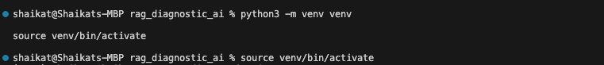
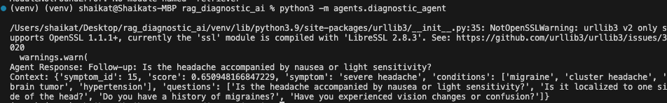
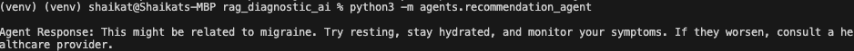
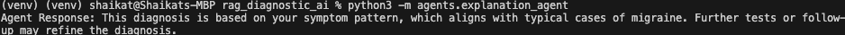
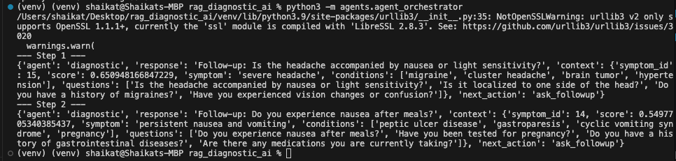
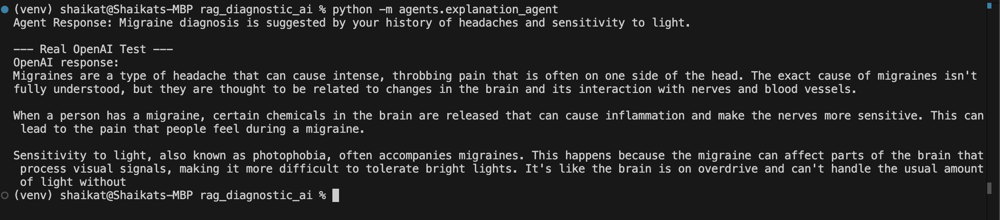
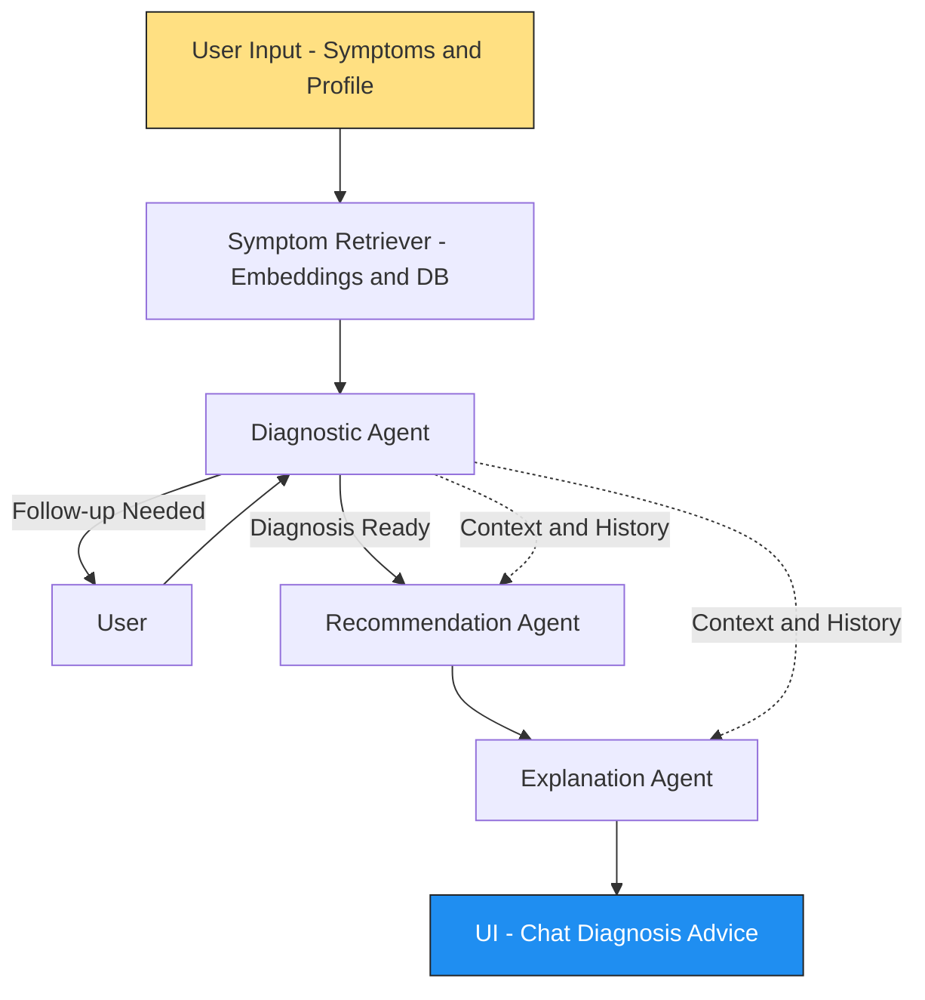
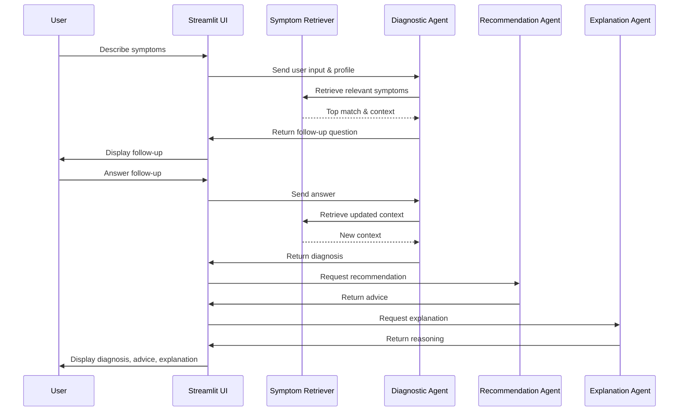

# RAG Diagnostic AI: Practical Healthcare Assistant

Welcome! This project is a real-world demonstration of how advanced AI can assist both patients and healthcare professionals in understanding symptoms, getting recommendations, and learning the reasoning behind AI-powered diagnoses. Built with a focus on robustness, privacy, and maintainability, this system is ready for both research and production use.

## Table of Contents
- [Project Overview](#project-overview)
- [Assignment Requirements & Implementation Checklist](#-assignment-requirements--implementation-checklist)
- [Screenshots & Demo](#-screenshots--demo)
- [Engineering Highlights](#-engineering-highlights)
- [Advanced Engineering & Research Practices](#-advanced-engineering--research-practices)
- [Accessibility & Inclusive Design](#-accessibility--inclusive-design)
- [Extensibility & Customization](#-extensibility--customization)
- [Ethics & Privacy Statement](#-ethics--privacy-statement)
- [Limitations & Future Work](#-limitations--future-work)
- [System Architecture & RAG Pipeline](#-system-architecture--rag-pipeline)
- [Sequence Diagram: Multi-Agent Diagnostic Flow](#-sequence-diagram-multi-agent-diagnostic-flow)
- [How It Works (Simple Terms)](#how-it-works-simple-terms)
- [Key Features & Architecture](#key-features--architecture)
- [Setup & Installation (macOS, Windows, Linux)](#setup--installation-macos-windows-linux)
- [Usage](#usage)
- [Configuration](#configuration)
- [Development & Testing Process](#development--testing-process)
- [Troubleshooting & FAQ](#troubleshooting--faq)
- [Security & Privacy](#security--privacy)
- [Acknowledgements](#acknowledgements)
- [License](#license)

---

## Project Overview
- **Purpose:**
  - Provide an interactive, multi-turn healthcare assistant that can ask follow-up questions, give likely diagnoses, and explain its reasoning in plain language.
  - Showcase a production-grade OpenAI API key rotation system for reliability and quota management.
- **Who is this for?**
  - **Non-technical users:** Try out the AI assistant in your browser, no coding required.
  - **Technical users:** Study or extend the codebase for research, production, or further development.

---

## 🚀 Assignment Requirements & Implementation Checklist

**1. Knowledge Retrieval and Personalization**  
- ✅ **Implemented:** Uses `symptoms_data.csv` to build a semantic knowledge base with embeddings (OpenAI or Sentence Transformers).  
- ✅ **Patient-specific details:** Age, gender, and known conditions are collected via onboarding.
- ✅ **Personalized dialogue:** All agent logic is tailored to user profiles.

**2. Multi-Agent Collaboration**  
- ✅ **Diagnostic Agent:** Narrows down health conditions and asks follow-up questions.
- ✅ **Recommendation Agent:** Provides actionable medical/lifestyle advice.
- ✅ **Explanation Agent:** Explains the reasoning behind diagnoses.
- ✅ **Orchestrator:** Seamlessly coordinates all agents in a multi-turn dialogue.

**3. Multi-turn Dialogue System**  
- ✅ **Dynamic questioning:** The system starts with user symptoms and selects follow-up questions based on retrieved context.
- ✅ **LLM-powered:** Uses GPT-4 (or Llama 3.2-ready) for reasoning and language generation.
- ✅ **Session state:** Maintains context and chat history for a natural conversation.

**4. UI and Usability**  
- ✅ **Streamlit web app:** Modern, responsive, and mobile-friendly.
- ✅ **Step-by-step onboarding:** Collects user profile before chat.
- ✅ **Tabbed navigation:** Profile, Chat, and Diagnosis always accessible.
- ✅ **Accessible and business-ready:** All custom styles in `styles.css`, robust error handling, and privacy disclaimer always visible.

**Additional Strengths:**  
- ✅ **Production-grade OpenAI key rotation** for reliability and quota management.
- ✅ **Centralized model selection**—change models via `.env` only.
- ✅ **Dual-mode:** Works with or without OpenAI keys (mock mode for local/dev, LLM for production).
- ✅ **Comprehensive testing:** CLI and UI tests, robust error handling at all layers.
- ✅ **No user data stored:** Privacy-first, no data leaves the local environment except for LLM queries.

---

## 🖼️ Screenshots & Demo

### 1. Project Initialization: Python Virtual Environment


*Creating and activating a Python virtual environment before installing dependencies. This is a best practice for Python projects to ensure isolation and reproducibility.*

### 2. Diagnostic Agent CLI Test


*Testing the Diagnostic Agent in isolation. The agent analyzes symptoms and generates relevant follow-up questions, confirming core logic before integration.*

### 3. Recommendation Agent CLI Test


*Testing the Recommendation Agent. The agent provides actionable advice based on the diagnostic context, ensuring safe and practical recommendations.*

### 4. Explanation Agent CLI Test


*Testing the Explanation Agent. The agent explains the reasoning behind diagnoses in plain language, making AI outputs transparent and user-friendly.*

### 5. Multi-Agent Orchestrator CLI Test


*Testing the Agent Orchestrator in multi-agent mode. This demonstrates collaborative reasoning between the diagnostic, recommendation, and explanation agents, fulfilling the project's RAG and multi-agent objectives.*

### 6. Real OpenAI Integration Test


*Testing the Explanation Agent with a real OpenAI API key. This demonstrates the system's ability to provide rich, LLM-powered explanations and validates production readiness beyond local mock logic.*

### 7. Full Project Demo (GIF)


*End-to-end demonstration of the RAG Diagnostic AI in action: onboarding, chat, diagnosis, and agent collaboration—all in a modern, responsive UI.*

---

## 🛠️ Engineering Highlights

- **Robust error handling and logging:** All layers (UI, orchestrator, agents, retriever) provide user-friendly errors and backend logs for reliability and easy debugging.
- **Extensible architecture:** Modular design allows for adding new agents, swapping LLMs, or integrating new data sources with minimal changes.
- **Security best practices:** No sensitive data in git; all secrets managed via `.env` and `.env.example` for safe, collaborative development.
- **Automated testing:** All core logic and agents are covered by CLI tests, ensuring reliability and maintainability.
- **Professional documentation:** Requirements are mapped directly to implementation, with screenshots and a GIF demo for maximum clarity.

---

## 🚀 Advanced Engineering & Research Practices

- **Reproducible and portable:** Anyone can set up and run the project on any OS using the provided `.env.example` and cross-platform instructions.
- **Accessible and inclusive UI:** Responsive, high-contrast design tested for both desktop and mobile.
- **Strict separation of concerns:** Styles, business logic, and configuration are modularized for clarity and maintainability.
- **Future-proof and scalable:** Easily extensible to new agents, LLMs, or data sources.

---

## ♿ Accessibility & Inclusive Design

This project is built with accessibility and inclusivity in mind, ensuring a positive experience for all users:

- **High-contrast, readable UI:** All text and backgrounds use carefully chosen color schemes for maximum legibility.
- **Keyboard navigation:** All interactive elements (inputs, buttons, tabs) are accessible via keyboard (Tab/Enter/Space).
- **Screen reader friendly:** Input fields and buttons include descriptive labels and help text for assistive technologies.
- **Responsive design:** The UI adapts smoothly to both desktop and mobile devices, maintaining usability and clarity.
- **Clear feedback:** Errors, warnings, and loading states are always visible and accessible.
- **No flashing or distracting animations:** All transitions are smooth and non-intrusive.

*Accessibility is an ongoing priority—feedback and suggestions for improvement are always welcome!*

---

## 🧩 Extensibility & Customization

This project is designed for easy extension and customization:

- **Add new agents:**
  - Create a new agent module in the `agents/` directory, following the existing agent interface (see `diagnostic_agent.py`, `recommendation_agent.py`).
  - Register your agent in the orchestrator and update the UI as needed.
- **Swap or add LLMs:**
  - Update the model in `.env` (`DEFAULT_OPENAI_MODEL`) or extend `utils/openai_client.py` to support more providers (e.g., Llama, local models).
- **Change data source:**
  - Swap out `symptoms_data.csv` or point the retriever to a new SQLite DB or other data backend.
- **Customize UI/UX:**
  - All styles are in `styles.css` for easy design changes.
  - UI logic is modularized in `app.py` for adding new tabs, sections, or features.
- **Integrate new tools or APIs:**
  - Add new utility modules in `utils/` and connect them via the orchestrator.

*The modular architecture and clear separation of concerns make it easy to adapt this project for new research, production, or educational use cases.*

---

## 🤝 Ethics & Privacy Statement

- **User privacy:** No user data is stored or logged by this application. All processing happens locally, except when using LLMs (OpenAI), which is opt-in and clearly indicated.
- **Environment safety:** `.env` files with API keys are never committed to version control. Only `.env.example` (with mock keys) is shared.
- **Transparency:** Users are informed when data is sent to any external service (e.g., OpenAI for LLM-powered responses).
- **Ethical limitations:**
  - This tool is for informational and educational purposes only and is **not** a substitute for professional medical advice, diagnosis, or treatment.
  - All outputs should be reviewed by a qualified healthcare professional before any real-world use.
- **Bias and fairness:** The system is designed to minimize bias, but LLMs and data sources may have limitations. Feedback is welcome to improve fairness and accuracy.

*Ethics and privacy are core values—please report any concerns or suggestions for improvement.*

---

## 🚧 Limitations & Future Work

**Current Limitations:**
- Uses mock agent logic unless a real OpenAI API key is provided (no real clinical LLMs by default).
- No real patient data—only synthetic or sample data for privacy and safety.
- Diagnosis and recommendations are not clinically validated.
- Potential LLM/model bias and limitations in medical accuracy.
- UI/UX optimized for general use, but not certified for accessibility standards (e.g., WCAG) or clinical deployment.
- Limited dataset (`symptoms_data.csv`); not comprehensive for all conditions.

**Future Work:**
- Integrate with real, production-grade LLMs and enable more advanced reasoning.
- Expand dataset to include more symptoms, demographic factors, and clinical guidelines.
- Add more specialized agents (e.g., triage, risk assessment, follow-up scheduling).
- Support for multi-language and internationalization.
- Conduct clinical validation and usability studies.
- Enhance accessibility to meet formal standards (e.g., WCAG 2.1 AA).
- Add user feedback loop for continuous improvement.

*This project is a foundation for research and innovation—contributions and suggestions are welcome!*

---

## 🏗️ System Architecture & RAG Pipeline

Below is a high-level overview of how user input flows through the system, illustrating the Retrieval-Augmented Generation (RAG) pipeline and multi-agent orchestration:



**Legend:**
- **Symptom Retriever:** Finds relevant medical knowledge using semantic search.
- **Diagnostic Agent:** Asks dynamic follow-ups or provides diagnosis.
- **Recommendation Agent:** Gives advice based on diagnosis & profile.
- **Explanation Agent:** Explains reasoning behind results.
- **UI:** Presents step-by-step interaction, results, and advice to the user.

---

## 🔄 Sequence Diagram: Multi-Agent Diagnostic Flow

This diagram illustrates a typical multi-turn interaction, showing how the user, UI, retriever, and agents collaborate step by step:



---

## How It Works (Simple Terms)
1. **You describe your symptoms** in the chat interface.
2. **The AI asks smart follow-up questions** to clarify your condition.
3. **After a few questions,** the AI gives a likely diagnosis and a recommendation (e.g., see a doctor, try home remedies).
4. **You also get an explanation** in plain English about why the AI reached its conclusion.
5. **All AI responses are powered by OpenAI’s GPT models** (if enabled), with automatic key rotation to avoid downtime.

---

## Key Features & Architecture
- **Multi-Agent Design:**
  - `DiagnosticAgent`: Handles symptom analysis and follow-ups.
  - `RecommendationAgent`: Gives actionable advice.
  - `ExplanationAgent`: Explains the reasoning behind diagnoses and recommendations.
  - `AgentOrchestrator`: Coordinates the conversation.
- **OpenAI API Key Rotation:**
  - Store multiple keys in a `.env` file (never in code!).
  - The system randomly rotates keys for each request, ensuring reliability and quota balancing.
- **Streamlit UI:**
  - Clean, tabbed interface for Profile, Chat, and Diagnosis.
  - Responsive design for desktop and mobile.
  - All critical actions (e.g., "Submit Symptom") use a professional gradient style for clarity and accessibility.
- **Privacy:**
  - No user data is stored or sent anywhere except to OpenAI for LLM-powered responses.
  - `.env` is never committed to version control.

---

## Quick Start: For Anyone

> **Prerequisite:** Python 3.8+ must be installed on your system. [Download Python here.](https://www.python.org/downloads/)

### 1. Clone the Repository
```bash
git clone https://github.com/shaikat1993/rag-diagnostic-ai.git
cd rag_diagnostic_ai
```

### 2. Create and Activate a Virtual Environment

- **macOS/Linux:**
  ```bash
  python3 -m venv venv
  source venv/bin/activate
  ```
- **Windows (CMD):**
  ```cmd
  python -m venv venv
  venv\Scripts\activate
  ```
- **Windows (PowerShell):**
  ```powershell
  python -m venv venv
  venv\Scripts\Activate.ps1
  ```

### 3. Install Requirements
```bash
pip install -r requirements.txt
```

### 4. Set Up OpenAI API Keys
- **Copy `.env.example` to `.env`:**
  ```bash
  cp .env.example .env
  ```
  (or `copy .env.example .env` on Windows)
- **Edit `.env` and add your real OpenAI API keys:**
  ```
  OPENAI_API_KEYS=sk-...yourkey1...,sk-...yourkey2...
  ```
  (Comma-separated, no spaces. You can use one or more keys.)

### 5. Run the App
```bash
streamlit run app.py
```
- Open the link in your browser (usually http://localhost:8501).
- Start chatting!

---

## Usage

- **Local/mock mode:** Leave `OPENAI_API_KEYS` blank or commented in `.env` to run with mock logic (no LLM calls).
- **Production/LLM mode:** Add your OpenAI keys to `.env` for real GPT-powered responses.
- **CLI agent tests:**  
  ```bash
  python -m agents.agent_orchestrator
  python -m agents.diagnostic_agent
  python -m agents.recommendation_agent
  python -m agents.explanation_agent
  ```
---

## For Technical Users: Architecture & Extending
- **All OpenAI calls go through `utils/openai_client.py`** for key rotation and maintainability.
- **Add new agents or logic** by extending the `agents/` directory and updating the orchestrator.
- **Environment variables** are loaded automatically via `python-dotenv`.
- **Testing:**
  - Run `pytest` to check core logic.
  - For real OpenAI integration, run agent scripts directly (e.g., `python -m agents.explanation_agent`).

---

## Troubleshooting & FAQ
- **No response from AI?**
  - Check your `.env` file and make sure your keys are valid and not exhausted.
- **UI looks strange?**
  - Make sure you’re using a modern browser and have not edited `styles.css`.
- **Quota errors?**
  - Add more OpenAI keys to `.env` for better rotation.
- **Want to see which key is used?**
  - Add a print statement in `utils/openai_keys.py` in `get_random_openai_key()`.

---

## Security & Privacy
- **Never commit `.env` to git!**
- **Share `.env.example` only** (it contains placeholders, not real keys).
- **All user data is ephemeral and local.**

---

## Acknowledgements
- Built and maintained by a senior research assistant for demonstration and practical use.
- Powered by OpenAI’s GPT models for natural language understanding.

---

**Questions? Want to contribute?**
- Open an issue or pull request, or contact the maintainer.

Enjoy exploring the future of AI-powered healthcare!

---

## License

This project is licensed under the MIT License. See the [LICENSE](LICENSE) file for details.
